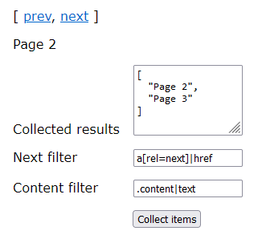

# Page Collect
Sequentially collects paginated data; data spread over many linked pages.

Abstract
--------
A function intended to simplify data extraction and page navigation tasks for web automation, such as user scripts for browsers, where often all data of interest is not presented on a single page, but spread out (paginated) over a collection of pages.

The function processes the current page, extracts items from it, scans it for a link to a following page and repeats the process for each subsequent linked page until the entire paginated set has been processed. Once the last page has been encountered, the returned Promise resolves with an array containing all the extracted items.

Pagination collection function
------------------------------
**Signature**: `pageCollect(nextLinkSelector, contentSelector [, options])`  

**Arguments**:

* `nextLinkSelector: Extractor`  
  This extractor is expected to return a URL (a string) signifying the next page to process. When the function returns a "falsy" value (false / null / undefined), it is treated as a signal that all pages have been processed, causing the pageCollect promise to resolve.

* `contentSelector: Extractor`  
  Responsible for extracting data from the pages. Data returned will be appended to the result array handed over to the promise `done` handler when there are no more pages to process.

**Returns**: a Promise that resolves to an Array of extracted items.  

_For more information on the Extractor type, see below_

Examples
--------
Extract some data from all paginated pages using CSS selector expressions.
````javascript
pageCollect(".nextlink | href", ".some-content | text")
.catch(err => console.error("Uh Oh, something went wrong", err));
.then(items => console.log("extracted items:", items));
````

The equivalent extraction behavior using custom data extraction functions:

````javascript
pageCollect(
  (doc) => Array.from(doc.querySelectorAll(".nextlink"))
           .map(a => a.getAttribute('href'),
  (doc) => Array.from(doc.querySelectorAll(".some-content"))
           .map(el => el.textContent.trim());
})
.catch(...).then(...)
````

Extractor
---------
Data extraction is performed using the notion of an "extractor". An extractor takes the shape of one of two forms; A slightly extended CSS expression or a user provided function. The definition of an extractor is:

    CSS expression | function(HTMLDocument): items[]

### Extractor as a CSS selector
When in the form of a CSS expression, the expression is applied to the entire document, just like issuing `Array.from(document.querySelectorAll(expr))`. The _extended_ bit refers to a syntax extension used to communicate *what* to extract from matched elements.

To declare what attribute to extract from matched elements, the CSS expression is terminated with `|<attribute name>`. If no extraction attribute sub-expression is provided, the extractor will simply return the extracted elements, to be included in the resolved result array.

Examples of expressions and the associated effects:

    a      -> An array of all links on the pages in the paginated set. Same as performing $$('a') on a page.

    a|text -> All contained link texts, same as issuing $$('a').map(a => a.textContent.trim()).

    a|html -> All contained HTML in the links, same as issuing $$('a').map(a => a.innerHTML.trim()).

    a|href -> The URLs (strings) of all links in the page set, same as issuing $$('a').map(a => a.getAttribute('href')) on the links.

Note: The attribute names `text` and `html` are the only ones with special meaning. Any other attribute name will result in the equivalent DOM element attribute being used for extraction. I.e. `"a|foo"` is equivalent to `$$(el).map(a => a.getAttribute('foo'))` being performed on all elements matching the CSS filter expression (the part before the pipe character, `"a"` in this case).

### Extractor as a function
For more sophisticated data extraction needs, a user provided function can also be used as an extractor.

**Signature**: `function(HTMLDocument) : item[]`

The function will be handed a HTMLDocument DOM element from which the function is expected to extract content items. It should return an array with zero or more values. Those values will be concatenated into the final result array when the pageCollect is resolved (all pages have been processed).

## Playground

The repository has a python web server app for testing. The server provides three linked pages with typical next and previous page navigation.

```bash
python test_server.py
```

Then open http://localhost:8000/ and click the `Collect items` button to trigger the following use:
```javascript
await pageCollect('a[rel=next]|href', '.content|text');

▶ Array(3) [ "Page 1", "Page 2", "Page 3" ]
```

The scraped item content will be show in the textarea, like this:



Or you can just load the page and play with the expressions from the browser console.